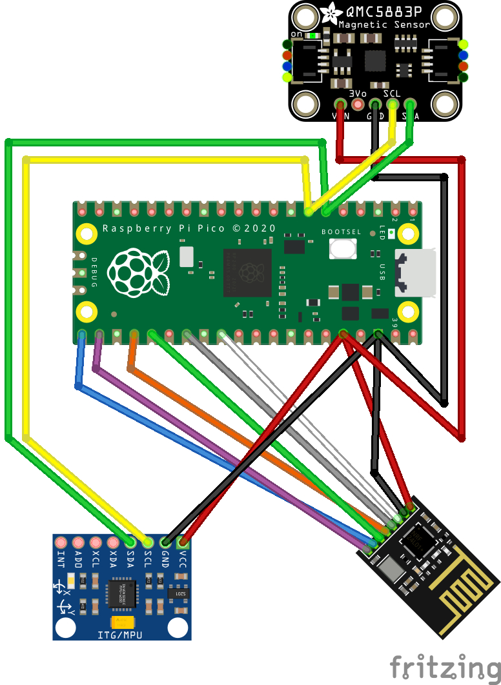

# mpu6050-attitude-ukf
Unscented Kalman Filter for real-time attitude estimation currently using the MPU6050 IMU.

---

### Motivation
This repo is a part of a bigger project. The final goal is to build a functional flight controller with as little as possible pre-built components. This implementation was also presented as a school project.

### Something about the algorithm
#### What is the purpose of the Unscented Kalman Filter?
Drones, cars, planes... all of these need to know their position, speed and orientation very accurately, and be able to trust the data 100% of the time. But the problem is not only that the raw sensors are not only noisy, but they can't even measure these values directly. All we have is a gyroscope measuring angular velocity in radians/s, an accelerometer measuring acceleration in meters/s, a magnetometer measuring the magnetic fields, and a few mathematical/physical formulas relating each of these indirectly to what we want to estimate. For example - by integrating angular velocity over time, we get total rotation. By measuring how the Earth's gravitation affects the three axes of an accelerometer, we can calculate the sensor's attitude. Similar technique can be applied to the magnetometer to get the total azimuth. However, sensors are very noisy, and they cannot be trusted individually. Integrating the gyroscope data accumulates error and renders it pretty much useless in a few seconds since every new estimation depends on all the previous. With the accelerometer, the calculation works well, but only when the sensor is perfectly stable. Once the accelerometer moves, the total length of the measured vector is more or less than one, making it unreliable. With the magnetometer, other magnetic fields indistinguishable from the Earth's magnetic field are present. Hence, we cannot trust our data once more.

We can solve this issue with an Unscented Kalman Filter, by modelling the physical system. With the assumption that the noises of all the sensors are gaussian, we can essentially define the whole physical system mathematically using a few matries (or in other words a few systems of equations). We can then combine the measurements in a way that is (not perfectly, but very) optimal.

#### Why Unscented?
The main advantage of an unscented kalman filter compared to its predecessor is the precision of applying non-linear transformations to gaussians. UKF's approach is simpler yet more precise than EKF's, which does it via jacobian matrices. On the other hand, UKF uses three meticulously selected and weighted points to represent the mean and covariance of the gaussian curve during the transformation. The unscented transform is exact to 2nd order for any nonlinear function and any distribution (and is exact to 3rd order for a gaussian distribution).

A simple visualization of the unscented transformation can be found here:
https://davidhovorka.github.io/unscented-transform-visualizer/

### This project uses the following hardware
- MPU6050 IMU
- QMC5883P 3 axis magnetometer
- NRF24 for radio communication

#### Wiring diagram

## TO-DO:
- Include a calibration program
- Include 3D visualization script (perhaps create a new repo?)
- Find ways to increase performance
